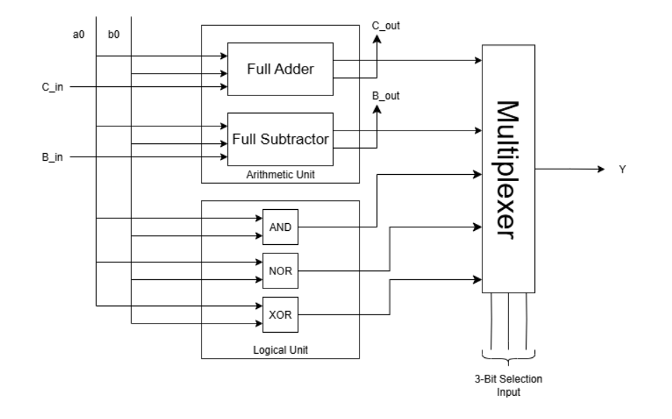

# 1-Bit ALU Module in Verilog

This repository contains a simple yet modular implementation of a **1-bit Arithmetic Logic Unit (ALU)** using Verilog HDL. This design forms the basic building block for constructing larger multi-bit ALUs in computer architecture.
## ALU Block Diagram

Below is the block-level representation of the 1-bit ALU showing the Arithmetic and Logical Units and how operations are selected via a 3-bit selection input.

## Features

- **1-bit Full Adder**
- **1-bit Full Subtractor**
- **Bitwise Logic Operations**:
  - AND
  - NOR
  - XOR
- **Selectable Operation via 3-bit `sel` input**
- **Carry and Borrow outputs**

## Inputs & Outputs

| Signal  | Direction | Width | Description                        |
|---------|-----------|-------|------------------------------------|
| `a0`    | Input     | 1     | First operand bit                  |
| `b0`    | Input     | 1     | Second operand bit                 |
| `c_in`  | Input     | 1     | Carry-in (used in addition)        |
| `b_in`  | Input     | 1     | Borrow-in (used in subtraction)    |
| `sel`   | Input     | 3     | Operation selector                 |
| `c_out` | Output    | 1     | Carry-out from addition            |
| `b_out` | Output    | 1     | Borrow-out from subtraction        |
| `y`     | Output    | 1     | Output result of selected operation|

## Operation Select Table (`sel`)

| `sel` value | Operation        | Output `y`  |
|-------------|------------------|-------------|
| `000`       | Sum (Add)        | `sum`       |
| `001`       | Difference       | `diff`      |
| `010`       | Bitwise AND      | `a0 and b0` |
| `011`       | Bitwise NOR      |`~(a0orb0)`  |
| `111`       | Bitwise XOR      | `a0 ^ b0`   |
| *others*    | Default (0)      | `1'b0`      |

## Files

- `alu.v` – Verilog HDL code for 1-bit ALU module
